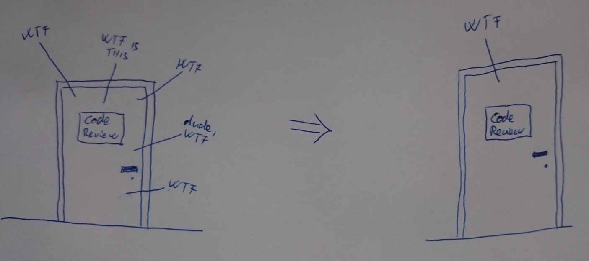

# eslint-config-client-shiwaforce

## Main concept, the idea behind the things below



We want to work with beautiful, nicely formatted code, so with the help of eslint we aim to enforce it - as much as we can. In an ideal world everybody would write such high quality code. Until we reach this state to standardise code formatting the eslint plugin can be a great help.

## Installation

1. Install dependencies:
	```
	npm install eslint eslint-config-client-shiwaforce --save-dev
	```
2. Create eslint config file, which name is `.eslintrc` with the following content
	```json
	{
		"extends": "eslint-config-client-shiwaforce"
	}
	```
3. Check the result by the following command line
	```
	./node_modules/.bin/eslint YOUR_FOLDER_OF_YOUR_JAVASCRIPT_FILES/**/*.js OTHER_FOLER_OF_FILES/**/*.js ANOTHER_FOLDER_OF_FILES/**/*.js
	```

## Usage

If you've installed eslint-config-client-shiwaforce locally within your project create the .eslintrc file at the root of your node project.
You can create this file (.eslintrc) at a different location but in this case you need to reference it manually. (see details on the eslint page, http://eslint.org/docs/user-guide/command-line-interface)

```json
{
	"extends": "eslint-config-client-shiwaforce"
}
```

Run the linter by executing the command below:

```
./node_modules/.bin/eslint YOUR_FOLDER_OF_YOUR_JAVASCRIPT_FILES/**/*.js
```
Where `client` is the folder where you store your client side javascript files.

In case of a global installation the start the linter with...

```
eslint YOUR_FOLDER_OF_YOUR_JAVASCRIPT_FILES/**/*.js
```
But your colleagues are will be sad if they doesn't have globally installed linter and try to run linter from package.json for example. We recommend use the linter from project dependency, and not from global installation.

---

If running eslint gives a message indicating that running `eslint --init` is necessary then you created the .eslintrc file in the wrong place.

This command does NOT walk the entire dependency tree based on `require`-s or `import`-s, it only walks the file or files listed here. Of course, wild card characters can be used. For more information please visit the dedicated page at eslint ([cli docs](http://eslint.org/docs/user-guide/command-line-interface))

## Extending/Overriding the config

You can modify the default recommended ruleset.

Add the `"rules"` key to your config then add your additional/override rules. For example, if you want to change the `"indent"` and `"eol-last"` rules from default to your own add this:

```json
{
	"extends": "eslint-config-client-shiwaforce",
	"rules": {
		"indent": [2, "space"],
		"eol-last":[0]
	}
}
```

If you use another 3rd party module (e.g. moment.js) and/or don't use all of our 3rd party modules (e.g. angular.js) you can override it in the `globals` block:

```
{
	"extends": "eslint-config-client-shiwaforce",
	"globals": {
		"angular": false,
		"moment": true
	},
}
```

## Additional information about rules

[Eslint](http://eslint.org)
